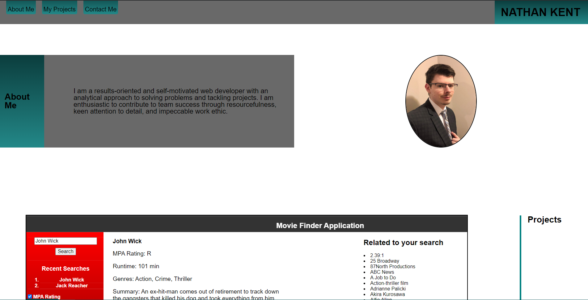
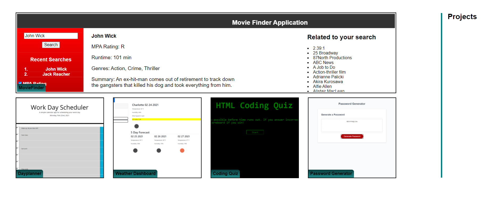

# ch8-updatedportfolio

## Table of Contents

 

[Description](#description)

[Screenshots](#screenshots)

## Description

 

This is an update to my portfolio. I added 5 new projects that I have completed over the course of my bootcamp,  updated my About Me section with real text, added a link to my resume, and fixed some minor issues with the CSS.

Link to Portfolio: https://ngkent75.github.io/ch8-updatedportfolio/

 
 
 

## Screenshots

 

New About Me section.

 

 

5 new projects inserted.

 

 

Link to resume added.

 

 

